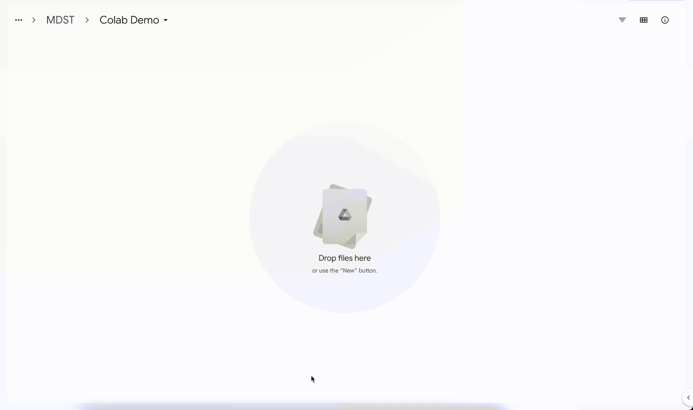
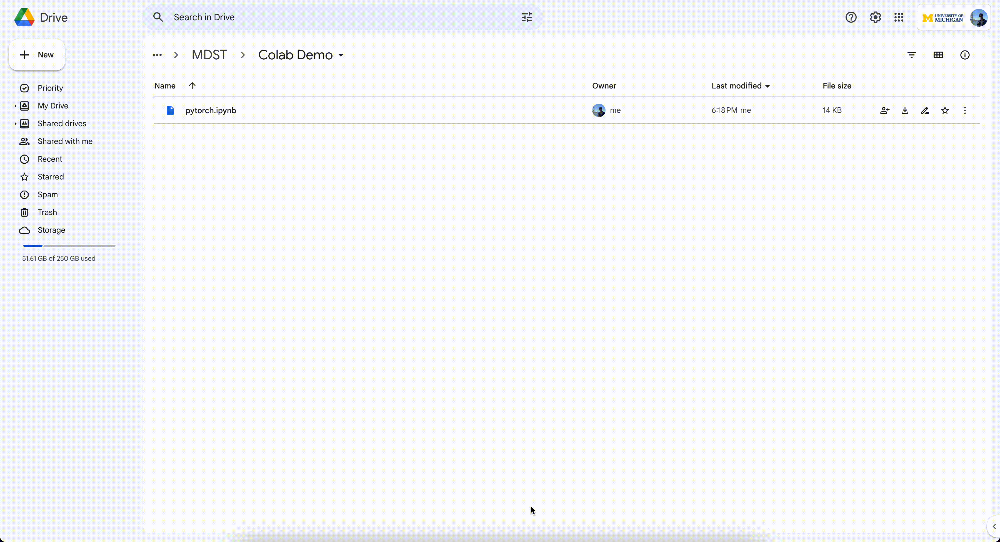
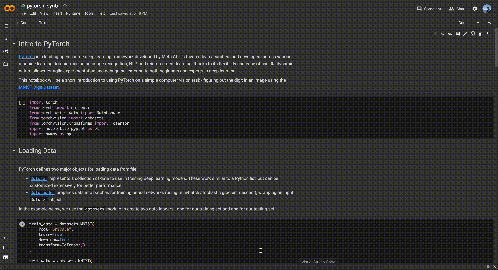

## Using Google Colab

We will be using Google Colabatory to run Python notebooks for this project. Google colabatory is an online cloud IDE developed by Google to run Python notebooks in a controlled execution environment requiring minimal setup.

Here is an example of how to upload and run code on Google Colab:

1. **Upload .ipynb file to Google Drive** - You can download the .ipynb notebook from GitHub and upload it to a folder in Google Drive.
   
2. **Open the notebook in Google Colab** - this can be as simple as double clicking on the file! If this doesn't work, you may need to right click the file, click the "Connect more apps" button, and add "Google Colabatory".
   
3. **Click Connect to start!** - This tells Colab to connect to Google servers and create a virtual workspace. You can then start running cells and executing Python code!
   

*Written by Sachchit